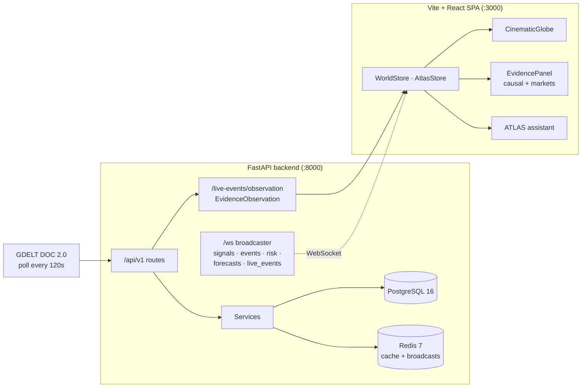

# MarketAtlas

MarketAtlas is a geospatial intelligence workspace that connects geopolitical
events to the markets and assets they touch. It ingests live events, places them
on a cinematic globe, composes a single canonical evidence record for the
selected event, exposes the recorded causal chain and affected-market
observations, and lets an evidence-grounded assistant (**ATLAS**) answer
questions strictly from the evidence on screen.

It is a full-stack application: a FastAPI backend (PostgreSQL, Redis, Celery)
and a Vite + React/TypeScript frontend built around a WebGL globe. The core
design principle is **no fabrication** — if the backend did not record a price,
a location, a confidence, or a causal link, the UI says so explicitly rather
than inventing a value.

---

## What it is

- **Live event ingestion** — a GDELT DOC 2.0 poller broadcasts new events to the
  browser over one WebSocket. Events are strictly validated and deduplicated
  before they reach the globe.
- **One evidence contract** — `GET /api/v1/live-events/observation` returns a
  typed `EvidenceObservation` envelope that composes the persisted event, its
  sources, impacts, affected assets, provider-backed market quotes, and
  recorded causal links. Everything downstream renders that one envelope.
- **Causal intelligence, bounded** — the UI shows only the causal hops the
  backend actually recorded (`EVENT → IMPACT → ASSET → MARKET OBSERVATION`),
  with each hop's recorded confidence and evidence reference, and states the
  gaps rather than filling them.
- **Evidence-grounded ATLAS** — the assistant answers from the exact
  observation displayed, cites provenance, and explicitly separates recorded
  evidence from unsupported inference. A deterministic fallback produces the
  same briefing when no LLM provider is configured.

## Core user journey

```
Landing → Register/Sign in (captcha) → Dashboard
        → Live Event → Globe → Evidence → Causal Intelligence → Markets → Asset → ATLAS
```

0. **Landing** — `/` is the public entryway: what MarketAtlas does, the
   no-fabrication guarantee, and the core journey, with CTAs into
   `/register` and `/login`. Signed-in visitors get a direct
   "Open workspace" CTA instead.
1. **Live Event** — a validated GDELT event appears in the timeline (or the
   clearly-labelled seeded `SIMULATED` feed when the backend is unreachable).
2. **Globe** — clicking a located event flies the globe to the backend-provided
   coordinates and commits it as the selection.
3. **Evidence** — the canonical `EvidenceObservation` for that selection loads
   in the evidence panel (freshness, provider, sources, impacts, status).
4. **Causal Intelligence** — the recorded causal chain renders as
   `EVENT → IMPACT → AFFECTED ENTITY/ASSET → MARKET OBSERVATION`, with explicit
   limitations where fields are absent.
5. **Markets** — affected assets appear with value/change, freshness, provider,
   and a `LIVE` / `STALE` / `SIMULATED` / `UNAVAILABLE` status chip.
6. **Asset** — clicking a market row or causal node re-focuses the globe through
   the same selection path, reloading evidence for that entity.
7. **ATLAS** — "Ask ATLAS about this evidence" answers from the observation on
   screen, grounded in a deterministic briefing and the backend grounding rules.

The full demo runbook and checklist live in [`docs/DEMO.md`](docs/DEMO.md).

---

## Authentication

Every workspace route (`/dashboard`, `/markets`, `/graph`, `/simulator`,
`/memory`, `/atlas`) is behind `RequireAuth`. Unauthenticated visitors are
redirected to `/login`; the landing page and auth pages are public.

- **Register / login** — `POST /api/v1/auth/register` and `/auth/login` return
  a JWT (24 h default) plus the user record; `/auth/me` restores the session on
  reload, and a stored token that the backend rejects is dropped immediately.
- **Captcha gate** — both endpoints require a server-issued captcha:
  `GET /api/v1/auth/captcha` returns a distorted SVG challenge (characters or
  an arithmetic sum) and a one-time `captcha_id`. The expected answer never
  leaves the server; it is stored in Redis (5-minute TTL) with an in-process
  fallback when Redis is unavailable. Verification is single-use — a failed
  attempt consumes the challenge and the UI fetches a fresh one. Disable in
  trusted environments with `AUTH_CAPTCHA_ENABLED=False`.
- **Token handling** — the SPA stores the JWT in `localStorage` and attaches it
  via an axios interceptor. A 401 from a non-auth endpoint clears the stale
  session and redirects to `/login`. `POST /auth/logout` acknowledges the
  sign-out (JWTs stay valid until expiry; a denylist is the future home for
  revocation).
- **Legacy demo auth removed** — the old silent "demo user" auto-registration
  is gone; unauthenticated means unauthenticated.

Verify the flow without Postgres/Redis running:

```bash
cd backend && PYTHONPATH="..:." python scripts/e2e_auth_check.py   # 20 checks
```

---

## Architecture



The demo flow needs only the backend and the built frontend. The optional
microservices in the monorepo (`market_agents`, `knowledge-graph-agent`,
`world_state`, `graph_engine`, `simulator`, `memory`) are wired separately and
degrade gracefully when absent — see
[`docs/DEPLOYMENT.md`](docs/DEPLOYMENT.md#9-graceful-degradation).

### Major components

| Component | Location | Responsibility |
|-----------|----------|----------------|
| API + middleware | `backend/app/main.py` | `/api/v1` routes, CORS, rate limiting (200 req/min), logging, metrics, `/ws` broadcaster, lifespan-started background tasks |
| Auth + captcha | `backend/app/routes/auth.py`, `backend/app/services/captcha_service.py` | JWT register/login/me/logout, server-issued single-use captcha challenges |
| Frontend auth | `frontend/src/context/AuthContext.tsx`, `frontend/src/auth/` | Session restore, login/register/logout, `RequireAuth` guard, protected-shell provider scoping |
| Landing page | `frontend/src/features/landing/LandingPage.tsx` | Public entryway: capabilities, journey, no-fabrication guarantee, CTAs |
| Live-event stream | `backend/app/services/gdelt_stream_service.py` | Polls GDELT DOC 2.0 every 120 s (no key), broadcasts validated events to `/ws` |
| Canonical evidence | `backend/app/routes/live_events.py`, `backend/app/schemas/observation.py` | Composes the `EvidenceObservation` envelope from persisted records + quotes + causal edges |
| Causal graph | `backend/app/services/canonical_causal_graph.py` | Persisted `event / impact / asset` hops only, with `evidence_class` and `status` |
| ATLAS backend | `backend/app/chatbot/api/routes.py`, `backend/app/chatbot/agents/` | Evidence-grounding rules, agent system prompt, `/api/chat/agent/turn` |
| World state store | `frontend/src/stores/WorldStore.tsx` | One live event store; bootstraps `/api/live-events` and merges WebSocket events |
| Evidence lifecycle | `frontend/src/features/evidence/useEvidenceSelection.ts` | The single evidence fetch path (dedupe, stale-drop, in-place refresh) |
| Evidence UI | `frontend/src/features/evidence/EvidencePanel.tsx` (+ `causalChain.ts`, `marketObservations.ts`) | Renders status, sources, markets, and the recorded causal chain |
| Globe | `frontend/src/features/globe/CinematicGlobe.tsx` | Particle globe, camera choreography, evidence highlights and causal arcs |
| Live socket | `frontend/src/services/websocket/useLiveWorldSocket.ts` | Validation, dedup, bounded reconnect, evidence-affecting detection |
| ATLAS frontend | `frontend/src/assistant/agent/` | Tool execution, context snapshot, deterministic evidence fallback |

---

## The canonical evidence contract (`EvidenceObservation`)

`GET /api/v1/live-events/observation` is the single read-only evidence
boundary. Its response type is defined once in
`backend/app/schemas/observation.py` and mirrored on the frontend in
`frontend/src/api/evidenceApi.ts`.

```
EvidenceObservation
├─ status            live | stale | degraded | unavailable | demo
├─ event              persisted event record (or none)
├─ sources            source articles
├─ impacts            event impact records
├─ entities / assets  affected entities and assets
├─ market_observations  provider-backed quotes, each with its own status
│                       (provider-backed | cached | simulated | unavailable)
├─ causal_chain       persisted causal edges
├─ provider_status    per-provider status map
└─ freshness / confidence / uncertainty / limitations
```

Design rules enforced across the stack:

- **One source of truth.** Market quotes and causal hops travel *inside* this
  envelope; the UI never runs a second evidence model or fetch path.
- **Missing ≠ invented.** `unavailable` observations render as `UNAVAILABLE`;
  missing optional fields render as `NOT PROVIDED`; an empty chain renders as
  `NO CAUSAL LINKS WERE RETURNED`.
- **Status is explicit everywhere.** Each status value carries a label and a
  plain-language meaning, never color alone.
- **Refresh keeps context.** A new selection loads fresh; refreshing the *same*
  selection updates in place and keeps the last good observation if a refresh
  fails.

The evidence feature's own contract notes live in
[`frontend/src/features/evidence/README.md`](frontend/src/features/evidence/README.md).

---

## Live vs simulated data

The application is explicit about provenance. Simulated data is labelled
`SIMULATED` (and deliberately not collapsed into a generic `DEMO` badge).

| Surface | Live (provider-backed) | Simulated / fallback |
|---------|------------------------|----------------------|
| Live events | GDELT → `/ws` `live_event_new` (validated, deduped) | Seeded events, tagged `SIMULATED` |
| Globe markers | backend lat/lng only | unlocated events are not placed |
| Evidence | canonical `EvidenceObservation` envelope | `unavailable` / `stale` envelopes, shown as such |
| Market observations | Alpha Vantage / yfinance quote (`provider-backed`) | `unavailable` (never a fake number); `cached` → `STALE`; `simulated` labelled |
| Causal chain | persisted event → impact → asset hops | no links → shown as not established |
| Sidebar market signals | — | seeded demo signals, labelled `SIMULATED` |
| ATLAS LLM | configured provider key | deterministic evidence briefing fallback; `/health` flags the mock |

A persisted live event that has no seeded impacts will honestly show empty
causal/market sections until impacts exist in the database. That is intended
behavior, not a bug.

---

## Stack

### Backend (`backend/`)

| Layer | Technology |
|-------|-----------|
| Language / framework | Python 3.12+, FastAPI, Uvicorn |
| Database | PostgreSQL 16 via SQLAlchemy 2.0 async (`asyncpg`) + Alembic migrations |
| Cache / broker | Redis 7 |
| Validation | Pydantic v2 + Pydantic Settings |
| Task queue | Celery (Redis broker) |
| Market data | `yfinance` (Yahoo Finance); optional Alpha Vantage for US quotes |
| AI | Provider abstraction (Perplexity / OpenAI / Gemini / Claude / Ollama) + a deterministic mock |
| Observability | Prometheus `/metrics`, structured request logging, deep `/health` |
| Testing | pytest + pytest-asyncio + httpx |

`settings` are environment-driven (`backend/app/config.py`); `APP_ENV=production`
requires a real `JWT_SECRET` and fails fast without one. Full variable list in
[`backend/.env.example`](backend/.env.example).

### Frontend (`frontend/`)

- Vite + React 19 + TypeScript (port 3000)
- `@react-three/fiber` + `three` for the WebGL globe, `globe.gl` / `d3` /
  `topojson-client` for geodata, GSAP for camera choreography, Recharts for
  market charts, Tailwind 4 for styling
- Axios client with a single `/api` base; Vitest + Testing Library (jsdom)

See [`frontend/package.json`](frontend/package.json) for exact versions.

---

## WebSocket architecture

There is exactly one live socket for the core flow: `/ws`.

- **Backend** — a single broadcaster (`app.state.broadcaster`) fans out to
  channels: `signals`, `events`, `risk`, `forecasts`, `live_events`. Auth-gated
  realtime at `/ws/chat` requires a `?token=` JWT.
- **Frontend** — `useLiveWorldSocket` subscribes to the world channels and
  treats every *world* event as untrusted input:
  - `parseLiveEventEnvelope` drops events missing an id, title, severity,
    coordinates, or a parseable timestamp, instead of inventing a country or
    position;
  - deduplication by id / source URL / title across reconnects and across the
    backend's dual `live_events` + `events` broadcasts;
  - bounded reconnect (max 4 attempts, base 5 s backoff, counter reset on a
    healthy open) that stops on unmount.
- **Merge, don't clobber** — `WorldStore` bootstraps `/api/live-events?limit=40`
  and merges socket-delivered events on top, deduplicated and bounded
  newest-first. Seeded events stay `dataMode: 'simulated'`; only validated
  backend events flip to `live`.
- **Evidence refresh** — when a validated event affects the current selection,
  the same in-place evidence refresh runs; the selection, panel, globe, and
  ATLAS context are preserved.
- Because the client uses a **relative** `/ws` path, any deployment that
  proxies `/ws` with a WebSocket upgrade works without code changes.

---

## ATLAS evidence grounding

ATLAS is a text/voice assistant whose answers about world state are grounded in
the canonical evidence envelope:

- The frontend context snapshot carries a **deterministic briefing**
  (`evidenceBriefing.ts`) covering what happened, sources, impacts,
  assets/markets, causal relationships, freshness/confidence/uncertainty, and
  an explicit `NOT ESTABLISHED` list for anything the envelope does not contain.
- The backend agent prompt (`build_agent_system_prompt` +
  `ATLAS_EVIDENCE_GROUNDING_RULES`) requires provenance citations and forces the
  phrasing "the evidence does not establish it" whenever the envelope lacks the
  answer.
- When no LLM key is configured, `/api/chat/agent/turn` returns 503 and the
  frontend uses a deterministic fallback that renders the identical briefing —
  so both paths answer from the evidence currently displayed, never a previous
  selection's.

ATLAS also routes globe visualization intents (route, country, region, risk,
conflict, network, abstract). Those are covered in
[`docs/intelligence-core.md`](docs/intelligence-core.md).

---

## Causal intelligence: what it does and does not claim

The causal view renders `EvidenceObservation.causal_chain` as
`EVENT → IMPACT → AFFECTED ENTITY/ASSET → MARKET OBSERVATION` without a graph
engine or a second model. For each hop it shows only what the envelope recorded:

- the recorded source/target labels and their recorded node types;
- the recorded confidence, or `CONFIDENCE NOT RECORDED`;
- the recorded evidence reference, or `EVIDENCE REFERENCE NOT RECORDED`;
- for an asset target, the market observation **already in the same envelope**
  (bound by exact provider symbol), or
  `NO MARKET OBSERVATION RECORDED FOR THIS ASSET`.

It never infers a relationship, price, or timestamp. A visible caveat states
that co-movement in time is not treated as cause, and an empty chain is shown
as `NO CAUSAL LINKS WERE RETURNED`.

---

## Technical highlights

Engineering depth that is actually implemented, not aspirational:

- **One canonical evidence contract end to end.** A single typed
  `EvidenceObservation` composes persisted records, quotes, and causal edges.
  The frontend mirrors the type and introduces no second market store, fetch
  path, or socket.
- **No-fabrication as a hard invariant.** Every gap renders as
  `UNAVAILABLE` / `NOT PROVIDED` / "not established"; provider failures return
  an explicit `unavailable` observation rather than a synthetic number, and
  simulated data is labelled at the record level.
- **Strict WebSocket ingestion.** Client-side envelope validation,
  cross-reconnect deduplication with a bounded seen-set, bounded backoff, and
  merge-don't-clobber bootstrap so a slow socket never wipes live events.
- **A resilient evidence lifecycle.** A generation counter drops stale
  responses, identical selections dedupe, in-place refresh keeps the last good
  observation on failure, and only backend-validated coordinates reach the globe.
- **Grounded assistant with a deterministic fallback.** The same briefing that
  grounds the LLM prompt powers the no-LLM path, so answers cannot drift from
  the observation on screen.
- **Graceful degradation by design.** `/health` reports DB/Redis/LLM status;
  missing Redis, LLM keys, market providers, or optional microservices each
  degrade a specific surface while the core flow stays usable.
- **Production-shaped frontend.** The dev server and `vite preview` share one
  proxy map, so the built SPA exercises the same `/api` and `/ws` wiring as
  development.

---

## Demo

> **Public deployment URL:** _placeholder — not yet deployed._
> Replace this line with the live URL once the frontend is hosted.

For the final demo, run the **built** frontend rather than the dev server.

```bash
# 1. Configure
cp backend/.env.example backend/.env            # DB_*, REDIS_URL, JWT_SECRET, one LLM key
cp frontend/.env.example frontend/.env.local

# 2. Backend (production, no reload)
cd backend && ../venv/bin/alembic upgrade head   # creates the users table for auth
PYTHONPATH="$(pwd):$(dirname "$(pwd)")" \
  ../venv/bin/uvicorn app.main:app --host 0.0.0.0 --port 8000

# 3. Frontend — build, then serve dist with the /api + /ws proxy
cd frontend && npm ci && npm run build && npm run preview   # http://localhost:3000
```

Verify with `curl localhost:8000/health`, open `http://localhost:3000` (the
landing page), create an account at `/register`, then walk the demo checklist
(`Live Event → Globe → Evidence → Causal Chain → Markets → ATLAS`).

### Optional: scenario simulator (`/simulator`, port 8007)

The **Scenario Simulator** page talks to the standalone simulator service. It is
optional — the core event → evidence flow does not need it, and the page shows an
error state until the service is running.

```bash
# 1. Install the simulator's dependencies into the shared venv (once)
venv/bin/python -m pip install -r simulator/requirements.txt

# 2. Run the simulator service on :8007 (from the repository root)
cd simulator
PYTHONPATH="$(dirname "$(pwd)")" ../venv/bin/uvicorn simulator.main:app \
  --host 127.0.0.1 --port 8007

# 3. Verify
curl localhost:8007/api/simulation/health
```

The frontend proxies `/api/simulation/*` and `/ws/simulation` to `:8007`
(`vite.config.ts`), so no frontend change is needed. `./dev.sh` starts the
simulator automatically when the `simulator/` directory is present.

| Guide | Contents |
|-------|----------|
| [`docs/DEMO.md`](docs/DEMO.md) | Demo runbook, checklist, live vs simulated components |
| [`docs/DEPLOYMENT.md`](docs/DEPLOYMENT.md) | Env vars, database & migrations, WebSocket + provider config, graceful degradation |

### Prerequisites

- Python 3.12+, Node.js 20+
- PostgreSQL 16 and Redis 7 (local, or
  `docker compose -f backend/docker-compose.yml up -d db redis`)
- Optional: one LLM provider key so ATLAS answers with a live model
  (`PERPLEXITY_API_KEY`, `OPENAI_API_KEY`, `GEMINI_API_KEY`, or `CLAUDE_API_KEY`)
- Optional: `ALPHA_VANTAGE_API_KEY` for US quotes (`yfinance` is the free
  fallback)

Full environment variable reference: [`docs/DEPLOYMENT.md`](docs/DEPLOYMENT.md)
and the two `.env.example` files.

---

## Testing & validation

```bash
# Backend
cd backend && ../venv/bin/python -m pytest -q        # 90 passed

# Frontend
cd frontend && npx tsc --noEmit                       # clean
cd frontend && npm test                               # 74 files / 321 tests
cd frontend && npm run build                          # production bundle

# Repo hygiene
git diff --check                                      # clean
```

The suites cover the evidence contract and lifecycle, causal-chain rendering,
market observations, live-event timeline and validation, ATLAS evidence
grounding, the auth context and captcha-gated auth pages, and the backend
observation/agent-prompt contracts.

---

## Known limitations

Documented, non-blocking limitations (drawn from `docs/DEMO.md` and
`docs/DEPLOYMENT.md`):

- **No public deployment yet.** The demo runs locally or on infrastructure you
  provide; the URL above is a placeholder.
- **Live-event latency.** GDELT is polled every 120 s, so a "live" event can
  take up to two minutes to appear.
- **Market coverage is provider-bounded.** Alpha Vantage's free tier is
  rate-limited; missing quotes render `UNAVAILABLE` by design rather than being
  backfilled with synthetic data.
- **Empty causal/market sections for unseeded events.** A persisted live event
  without impact/asset rows honestly shows no causal links and no markets.
- **Desktop-first layout.** The command center uses a fixed right rail and is
  not a mobile-first layout.
- **Optional microservices.** `graph_engine`, `simulator`, `world_state`,
  `memory`, `market_agents`, and `kg-agent` are not required for the core flow;
  their panels degrade when those services are absent.
- **No fabrication guarantee has a cost.** Degraded providers surface as
  `unavailable` rather than a best-effort value.

---

## Repository layout

| Directory | Purpose |
|-----------|---------|
| `backend/` | FastAPI + Celery service, PostgreSQL/Redis, canonical evidence and ATLAS subsystems |
| `frontend/` | Vite + React/TypeScript SPA with the globe, evidence, markets, and ATLAS surfaces |
| `docs/` | Architecture, API contract, deployment, demo, and intelligence-core documentation |
| `market_agents/`, `knowledge-graph-agent/`, `world_state/`, `graph_engine/`, `simulator/`, `memory/`, `pipelines/`, `chat-bot/` | Optional services and shared packages started by `dev.sh` when present |
| `dev.sh` | Development orchestrator — starts available services in parallel |

## Documentation

- [`docs/DEMO.md`](docs/DEMO.md) — demo runbook and checklist
- [`docs/DEPLOYMENT.md`](docs/DEPLOYMENT.md) — production-style setup and degradation
- [`docs/intelligence-core.md`](docs/intelligence-core.md) — ATLAS brain → backend → globe pipeline
- [`docs/architecture-assessment.md`](docs/architecture-assessment.md) — architecture findings and target control model
- [`docs/api-contract.md`](docs/api-contract.md) — API endpoint specifications
- [`frontend/src/features/evidence/README.md`](frontend/src/features/evidence/README.md) — evidence contract and behaviors
