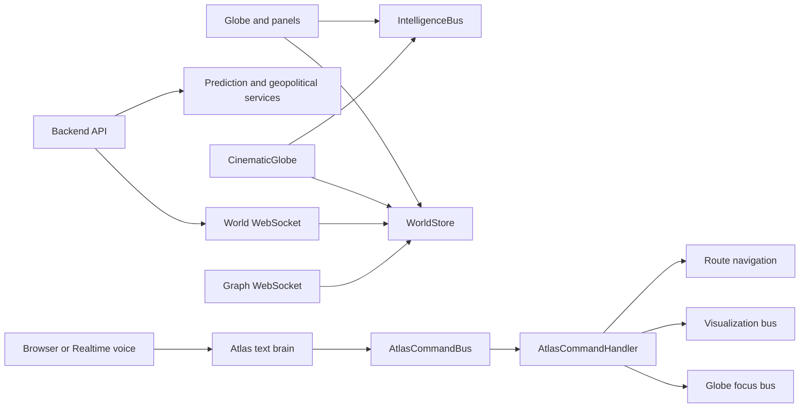
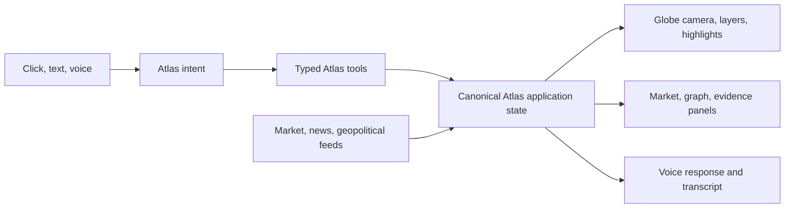

# MarketAtlas Architecture Assessment

## Current shape

## Findings

- The globe is already the primary surface and has reusable camera, polygon, route, company, and causal-graph rendering in `frontend/src/features/globe/CinematicGlobe.tsx`.
- Atlas control is split across `commandBus`, `globeFocusBus`, `visualizationBus`, `intelligenceBus`, React Router, and `WorldStore`. Commands can mutate one surface without producing a complete, inspectable application state.
- `AtlasCommandHandler` is the best existing action boundary. It should become the single executor for text, voice, and direct-manipulation intents.
- `useLiveWorldSocket` uses one parser for unrelated world and graph protocols and does not send the backend subscription handshake.
- `RealtimeVoice` requests `/api/assistant/realtime-token` with `GET`, while the backend exposes `POST`.
- `WorldStore` seeds market intelligence and periodically creates synthetic events. `predictionApi.ts` generates random financial conclusions when the backend fails. These paths must be explicit demo data only and must never be presented as live intelligence.
- Backend prediction, event, graph, and market services already provide reusable intelligence contracts. The frontend should preserve their provenance, freshness, uncertainty, and degraded states instead of replacing them with local fallback conclusions.
- The health endpoint reports broad service status but does not expose feature capabilities to the UI.
- The frontend build currently depends on `topojson-client` and `world-atlas` assets; the environment must install frontend dependencies before build validation can be trusted.

## Target control model

The canonical state is the shared context for Atlas. Tools are deterministic UI actions; analysis services remain responsible for evidence-backed conclusions. A failed service returns `unavailable`, `stale`, or `degraded`, never fabricated financial output.

## Phased implementation

1. Establish canonical Atlas state and typed action execution; fix voice and WebSocket contracts; remove deceptive fallbacks.
2. Expand globe layers and camera/highlight commands through the canonical action boundary.
3. Route text and voice through the same tool plan and expose current UI context to the agent.
4. Project event-to-market causal chains with provenance and uncertainty onto the globe.
5. Add professional market surfaces around the globe without displacing it as the primary interface.
6. Harden accessibility, performance, observability, and contract coverage.
