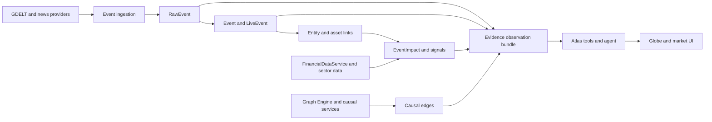

# Phase 4 Intelligence Assessment

## Reusable evidence path

The strongest production sources are `backend/app/services/gdelt_stream_service.py`, `backend/app/services/financial_data_service.py`, `backend/app/services/live_event_service.py`, and the existing event/live-event/impact models. The causal graph and supply-chain services are useful but currently have overlapping static implementations.

## Gaps controlling Phase 4

- Atlas tools mostly emit browser commands and do not retrieve backend observations.
- `RawEvent` can preserve provider payloads, but ingestion paths do not consistently attach raw-event provenance to normalized observations.
- Event, impact, market, and causal contracts expose source/confidence fields inconsistently.
- Frontend realtime parsing expects flat payloads while several broadcasters wrap data under `data`.
- Static and degraded fallbacks exist across market-agent, causal-graph, prediction, and market-data paths. They must be explicitly labeled and never presented as current evidence.

## Smallest implementation slice

Create a read-only evidence observation endpoint that composes existing live events, source articles, linked entities/assets, impacts, market snapshots, and causal edges. Evolve Atlas intelligence tools to call that endpoint while retaining their current UI command behavior. Return a normalized observation envelope with provider status, freshness, provenance, confidence, uncertainty, and causal links. If a provider is unavailable, return `degraded` or `unavailable` rather than a fabricated observation.
